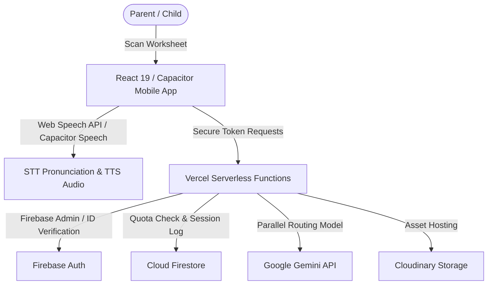

# 🦅 Chekki AI (채키) — EdTech Product & Architecture Profile

### **"채점은 채키가, 칭찬은 엄마가" (Grading by Chekki, Praise by Mom)**
*Transforming the high-friction "homework battle" into an engaging bonding and learning moment for bilingual families.*

---

## 🎯 Executive Overview & Product Vision

**Chekki AI** is a specialized educational companion mobile application designed for parents whose children (ages 5–7) attend **English Kindergartens (EK)** in South Korea (such as *Poly, GATE, PSA, and ECC*). 

### The Core Problem
The English Kindergarten curriculum in Korea is academically rigorous, moving quickly from phonics to complex sentence writing. Parents face **"Double Stress"** every evening:
1. **Academic Stress:** Checking high-level phonics and grammar worksheets after a full workday.
2. **Emotional Friction:** The tension and crying matches that frequently occur when correcting a child's homework mistakes.

### The Chekki Solution
Chekki AI solves this by acting as a warm, pedagogically sound AI mediator. Instead of offering dry, red-pen corrections or a raw answer sheet, Chekki equips parents with **bilingual explanations** and **emotional scaffolding scripts** ("Mom's Scripts"). Parents gain the confidence to teach, while children receive guided hint-based support, transforming homework into positive reinforcement.

---

## 🛠️ Technology Stack & Architecture

Chekki AI is built on a modern, hybrid mobile-web architecture optimized for high performance, rapid iteration, and direct cross-platform deployment.

### 1. Frontend & Mobile Bridge
*   **Framework:** **React 19 (TypeScript)** for modular, stateful UI components.
*   **Mobile Platform:** **Capacitor JS (v8)** to bundle and bridge the React code into high-performing, native iOS and Android packages.
*   **Styling:** Custom-crafted **Vanilla CSS** combined with **Tailwind CSS (v4)** for premium, hardware-accelerated animations, glassmorphism overlays, and smooth transitions.
*   **Localization:** Multi-language support driven by a global React [LanguageContext.tsx](file:///Users/jasonbenjamin/Projects/Chekki-AI-main/contexts/LanguageContext.tsx).

### 2. Backend & Serverless API
*   **Host Platform:** **Vercel Serverless Functions** (configured via [vercel.json](file:///Users/jasonbenjamin/Projects/Chekki-AI-main/vercel.json)).
*   **Core Controller:** [api/analyze.ts](file:///Users/jasonbenjamin/Projects/Chekki-AI-main/api/analyze.ts) handles token verification, security check enforcement, parallel AI model dispatch, and structured schema formatting.
*   **Integrations:**
    *   **Firebase Auth:** Identity verification using Firebase ID Tokens.
    *   **Cloud Firestore:** Manages user limits (daily scans, questions, generates), B2B school code redemptions, and logs session events.
    *   **Cloudinary:** Storage provider for scanned worksheet media assets.

### 3. Artificial Intelligence Engine
*   **SDK:** `@google/genai` (v1.3.0) communicating directly with Google's Gemini models.
*   **Routing Logic:** **Parallel Hybrid Execution Model** in the backend. 
    *   *Fast Pass:* Dispatches requests to **Gemini 2.5 Flash** for quick OCR, layout parsing, title extraction, and initial coordinate mapping.
    *   *Deep Pass Fallback:* Dispatches requests to **Gemini 2.5 Pro** with a **20,000 token thinking budget** if the fast pass returns zero elements or fails to parse complex phonics structures. This double-checks handwriting and pedagogical context (e.g., ensuring a child's hand-drawn "8" isn't misread as a "B").

---

## 💎 Key Features & Implementation Files

### 1. Magic Scan & Ink Overlay
*   **How it works:** A parent snaps a photo of a worksheet. The backend returns absolute coordinates (`ymin`, `xmin`, `ymax`, `xmax` on a 0-1000 scale). The frontend calculates viewport boundaries and overlay positions, drawing the correct answers directly on the digital worksheet with a natural "ink" aesthetic.
*   **Core Code:** [components/WorksheetOverlay.tsx](file:///Users/jasonbenjamin/Projects/Chekki-AI-main/components/WorksheetOverlay.tsx) handles coordinate mapping and rendering, while [src/hooks/useWorksheetAnalysis.ts](file:///Users/jasonbenjamin/Projects/Chekki-AI-main/src/hooks/useWorksheetAnalysis.ts) manages the scanning state.

### 2. "Mom's Script" & Pedagogical Guides
*   **How it works:** Tapping any overlaid answer triggers a detail card. Instead of just showing "A. Apple", it outputs:
    *   *Korean Guide:* Explains the phonics rule simply for the parent (e.g., *"The silent 'e' makes the 'a' sound long"*).
    *   *Teaching Script:* A dialogue template the parent can read out loud to prompt their child (e.g., *"Wow, look at this! What sound does the letter 'A' make here? Let's say it together!"*).
*   **Core Code:** [components/WorksheetItemCard.tsx](file:///Users/jasonbenjamin/Projects/Chekki-AI-main/components/WorksheetItemCard.tsx) displays the guide and dialogue.

### 3. Native Pronunciation & Interactive Speech Coach
*   **How it works:** Uses native English Text-to-Speech (TTS) so the child can listen to correct vowel blends. It also integrates Capacitor Speech Recognition (STT) so the child can say the answer into the microphone. Chekki analyzes the audio, and if matched, displays a dopamine-triggering star badge accompanied by haptic feedback.
*   **Core Code:** Native speech hooks inside [components/WorksheetItemCard.tsx](file:///Users/jasonbenjamin/Projects/Chekki-AI-main/components/WorksheetItemCard.tsx).

### 4. Interactive AI Tutor (Ask Chekki)
*   **How it works:** An interactive chat bar at the bottom of the analysis screen. If a child needs further clarification, parents can ask the AI Tutor for simple analogies, alternative vocabulary examples, or preschool-level grammar breakdowns.
*   **Core Code:** [components/AskChekkiBar.tsx](file:///Users/jasonbenjamin/Projects/Chekki-AI-main/components/AskChekkiBar.tsx) manages the conversational history (capped at 10 turns) and streams responses.

### 5. Mistake Bank ("오답 노트")
*   **How it works:** Bookmarked worksheet items are saved to the user's local mistake bank in Firestore, letting them review challenging phonics or spelling lists during weekend review sessions.
*   **Core Code:** [components/OdapNoteModal.tsx](file:///Users/jasonbenjamin/Projects/Chekki-AI-main/components/OdapNoteModal.tsx) handles storage and retrieval.

---

## 🛡️ Enterprise-Grade Backend Security & Rate Limiting

The backend [api/analyze.ts](file:///Users/jasonbenjamin/Projects/Chekki-AI-main/api/analyze.ts) features solid defenses against API abuse and token depletion:
1.  **Firebase ID Token Authentication:** All non-guest requests are validated using Firebase Admin Auth tokens.
2.  **Global Burst Protection:** Rate limits IP addresses to a maximum of 5 requests per minute using Firestore-based atomic increments (`ratelimits/burst_{ip}`).
3.  **Tiered Limit Enforcement:**
    *   *Guests:* Hard-capped at 5 scans/day per IP.
    *   *Free Members:* Capped at 3 worksheet scans per day.
    *   *Pro Members:* Access to unlimited scans and high-reasoning Gemini models via RevenueCat billing checks.

---

## 📈 EdTech B2B Expansion & Future Roadmap

Chekki's development roadmap focuses on maximizing student engagement and unlocking institutional revenue:

1.  **Academy Dashboard (B2B SaaS):**
    *   Allows English Kindergartens and after-school centers to upload their weekly curriculum vocabulary. This pre-seeds the Gemini context window, boosting OCR correction accuracy to near 100% for specific school worksheets.
2.  **"Clone My Worksheet" (Pro Generator):**
    *   Generates a new, printable practice canvas using the same question structure but replacing the words with fresh vocabulary at the child's level.
3.  **Digital Sticker Board (Gamification):**
    *   A 3D virtual sticker book (Space, Dinosaur, or Animal themes) where children earn stickers for completing pronunciation speaking drills, driving Daily Active Users (DAU).
4.  **Weekly "Mom's Report" (Analytics):**
    *   Provides parents with an automated summary of the phonics rules and vocabulary terms the child struggled with over the week, detailing progress and offering actionable feedback.
