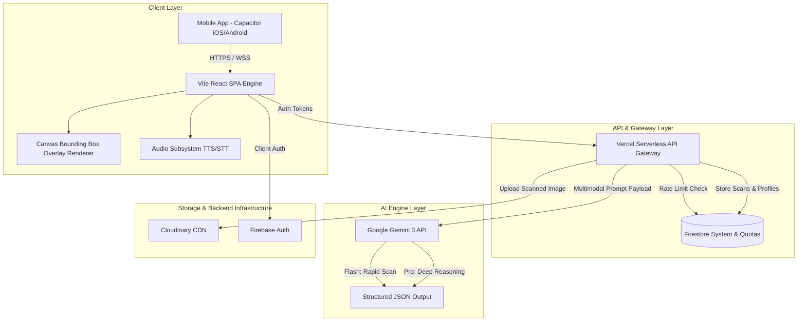
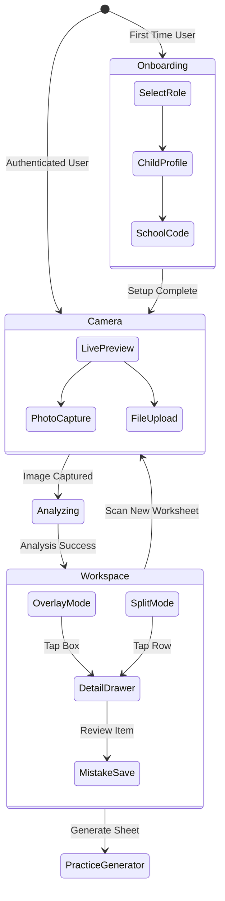
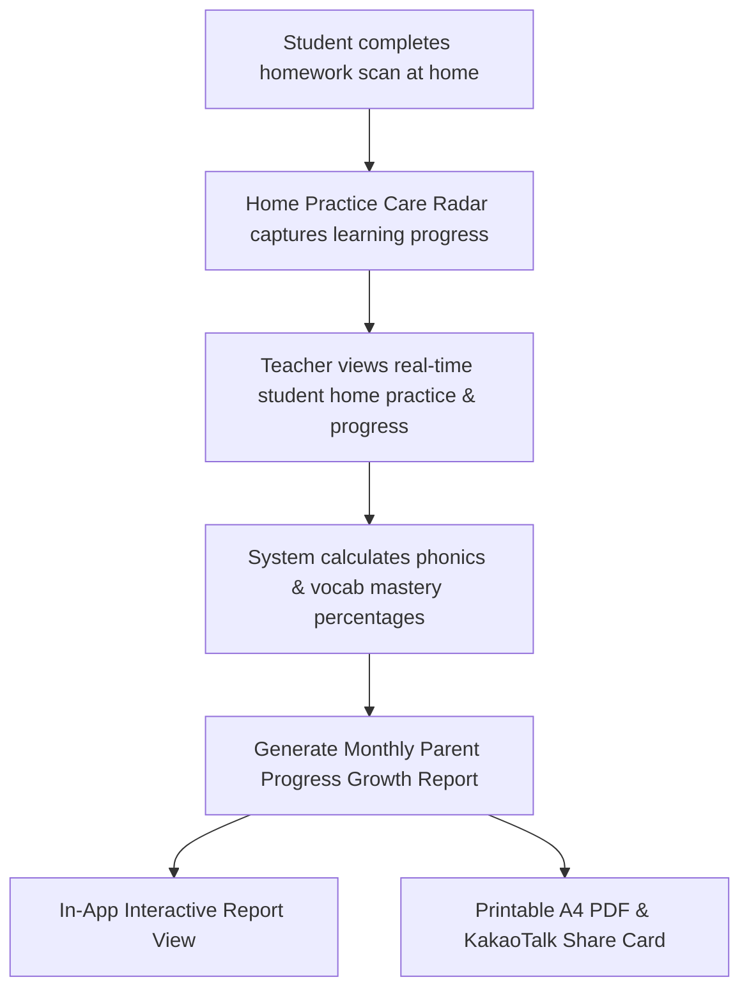
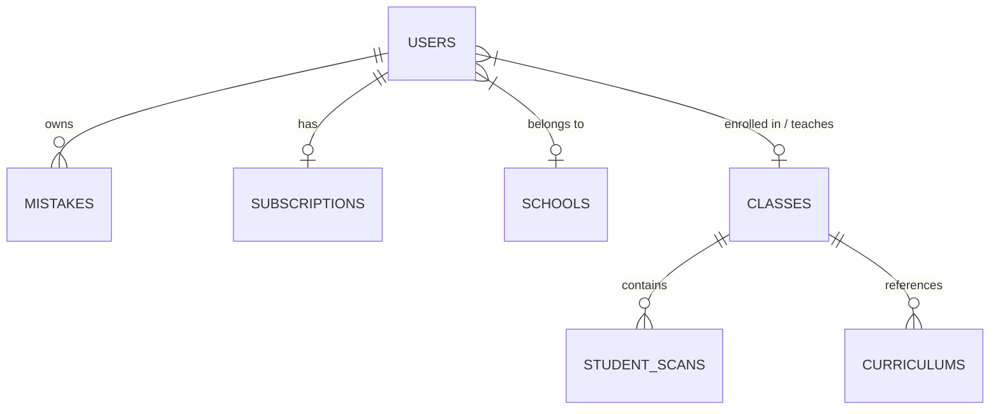
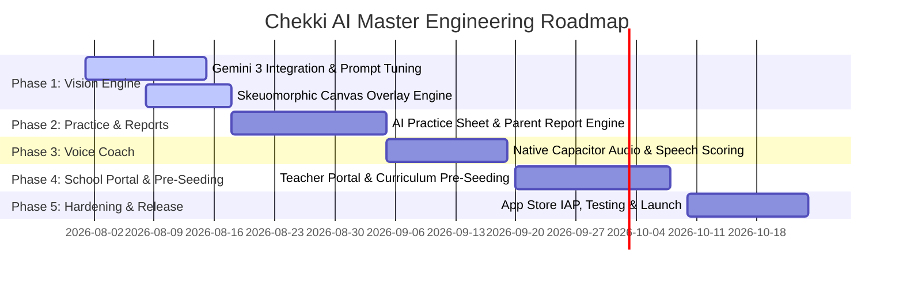

# 🦅 Chekki AI - Consolidated Master Specification & System Documentation

**Document Version:** 2.0  
**Status:** Approved / Active  
**Last Updated:** July 30, 2026  
**Target Audience:** Product Managers, Software Engineers, UI/UX Designers, Database Administrators, System Architects, QA Teams  

---

## 📋 Master Table of Contents
1. [Section 1: Product Requirements Document (PRD)](#-section-1-product-requirements-document-prd)
2. [Section 2: Technical Design Document (TDD)](#-section-2-technical-design-document-tdd)
3. [Section 3: User Flow Diagrams & App Trajectories](#-section-3-user-flow-diagrams--app-trajectories)
4. [Section 4: UI/UX Design Brief & Visual Guidelines](#-section-4-uiux-design-brief--visual-guidelines)
5. [Section 5: Database Schema & Firestore Architecture](#-section-5-database-schema--firestore-architecture)
6. [Section 6: Engineering Master Plan & Implementation Roadmap](#-section-6-engineering-master-plan--implementation-roadmap)

---

# 🎯 Section 1: Product Requirements Document (PRD)

## 1.1 Executive Summary
**Chekki AI** is an AI-powered EdTech application designed to bridge physical learning materials with digital intelligence. Operating primarily in South Korea, Chekki AI empowers parents of children (aged 5–7) attending English Kindergarten (EK) and elementary hagwons (private academies) to instantly scan, evaluate, and coach their children on English homework—without needing fluent English skills themselves.

By transforming a routine paper worksheet into an interactive, digital workspace with real-time answer verification, contextual Korean parenting scripts, native voice coaching, teacher curriculum pre-seeding, automated progress reporting, and adaptive AI practice sheet generation, Chekki AI transforms daily "homework battles" into positive parent-child bonding moments.

---

## 1.2 Problem Statement & User Personas

### Problem Statement
1. **Parent-Child Homework Friction:** Parents in high-density Korean education zones (Daechi, Mok-dong, Haeundae) experience high stress managing late-afternoon homework. Correcting mistakes in a second language often leads to emotional exhaustion.
2. **Language Barrier for Parents:** Many non-native English-speaking parents struggle to understand nuance in complex phonics, reading comprehension, or grammar worksheets.
3. **Teacher Prep Load:** Hagwon and EK teachers spend excessive hours generating supplementary drill sheets and manually grading paper homework.

### User Personas

#### Primary Persona: Korean EK Parent ("Min-ji", 34)
* **Demographics:** Mother of a 6-year-old child in an English Kindergarten (Seoul/Busan).
* **Goals:** Ensures child completes homework accurately while fostering confidence and a loving relationship.
* **Pain Points:** Low English fluency, exhausted after work, worried about giving incorrect explanations or scolding her child.
* **Key Needs:** Instant worksheet checking, Korean translation, exact words to say ("what to speak"), warmth and empathy.

#### Secondary Persona: Hagwon ESL Teacher ("David", 28)
* **Demographics:** Native English instructor at a Seoul Hagwon.
* **Goals:** Efficiently grade student assignments, track recurring student errors, pre-seed weekly textbook units, and quickly generate customized extra practice sheets.
* **Pain Points:** Time wasted on repetitive grading, difficulty giving personalized feedback to 20+ students daily.

---

## 1.3 Core Feature Specifications

### Feature 1: Magic Scan (Multimodal OCR & Answer Verification)
* Real-time camera capture of physical worksheets with automatic boundary detection and AI analysis.
* Returns structured JSON containing worksheet summary, bounding box coordinates `[ymin, xmin, ymax, xmax]`, questions, correct answers, student response, and handwriting tips.
* Renders interactive skeuomorphic ink overlays directly on top of the original paper photograph.

### Feature 2: Korean Parenting Script Engine ("What to Say")
* Translates technical corrections into warm, empathetic scripts for parents to read aloud (`teaching_script_ko`).
* Provides positive reinforcement scripts for correct answers to boost child confidence.

### Feature 3: AI Practice Sheet Generator (Pro Feature)
* On-demand generation of custom practice worksheets targeting specific student weaknesses.
* Exports clean printable PDF sheets formatted for home printing (A4/Letter).

### Feature 4: Native Pronunciation & Voice Coach (Pro Feature)
* Native English Text-to-Speech (TTS) playback and Speech-to-Text (STT) speech recognition scoring.
* Evaluates child spoken responses against expected answers and awards star badges.

### Feature 6: Dedicated FT & KT Dashboards with Role-Gated Access Control (`/teacher`)
* **Foreign Teacher (FT) View (`educatorRole: 'ft'`):** Dedicated workspace for English instructors. Access to `📊 Class Dashboard`, `📘 Manage Syllabus`, `📄 Manage Homework`, and `📜 My History`. AI Report Studio is hidden to prevent parent miscommunication.
* **Korean Teacher (KT) View (`educatorRole: 'kt'`):** Access to all FT features + **`📄 AI Report Studio`** (`/report-studio`), **`✍️ FT Form Attribution Badges`** (*Submitted by Teacher Mark (FT)*), **`💬 Pre-Translated Korean Comments`**, and **`👥 Student Approvals`**.
* **Director HQ Admin Portal (`NativeDirectorPortal`):** Executive campus command center with student roster management, teacher class allocations, curriculum stream oversight, and **Director-Only Brand Logo Management**.

### Feature 7: Single-Use Authorization Code System & Automated Role Routing
* **Single-Use Consumption Guardrails:** Authorization codes (`FT-APEX10`, `KT-APEX10`) can only be registered once. Upon sign-up, the code is marked as `CONSUMED` and locked to the user's UID. Re-use attempts by other users are blocked.
* **Automated Respective Dashboard Routing:** Subsequent logins with Email & Password automatically detect stored role bindings (`ft`, `kt`, `director`) and route straight to their respective dashboard.
* **Revocation & Replacement Codes:** Revoking a teacher seat automatically generates a brand-new, unique single-use code for replacement staff.

### Feature 8: Worksheet Format & Question Style Selectors
* **Worksheet Formats:** 1-Click selection between `Daily Homework`, `Weekly Review Quiz`, `Phonics & Vocab Tracing`, and `Reading Comprehension`.
* **Question Style Formats:** 1-Click selection between `Multiple Choice (4-choice)`, `Fill-in-the-Blanks`, `Unscramble Sentences`, `Vocab Matching`, and `Short Answer` for precise AI autograding.

### Feature 9: Director-Only Academy Logo & Brand Management
* **Centralized Brand Control:** Logo uploading and editing is restricted exclusively to the Director HQ Admin Portal (`NativeDirectorPortal`).
* **Enforced Specs:** Enforces format specifications (`PNG`, `JPG`, `SVG`, `WEBP`), resolution (`400x400px` square or `600x200px` horizontal), and size (`Max 5MB`).
* **Automatic Campus Inheritance:** Saved logos automatically render on all FT & KT dashboard headers, printable A4 PDF reports, and KakaoTalk script footers.

### Feature 10: AI Content Safety & Bad Words Guardrail System
* Automated real-time regex filtering against an educational profanity safety dictionary (`checkContainsBadWords`).
* High-visibility alert banners and curriculum save restrictions when inappropriate language or bad words are detected in teacher input or OCR extractions.

---

## 1.4 Monetization & B2B SaaS Tiering Architecture

| Plan Tier | Monthly Price (KRW / USD) | Yearly Price (20% Off) | Included Seats & Features |
| :--- | :---: | :---: | :--- |
| **공부방 / 개인 교습소 (`solo`)** | **`₩39,000 / 월`** ($29/mo) | **`₩31,000 / 월`** ($23/mo) | • **1 Teacher Seat** (Dual FT & KT access)<br>• Up to 20 Active Students<br>• Full Autograding & Report Studio |
| **스타터 소형 어학원 (`starter`)** | **`₩69,000 / 월`** ($49/mo) | **`₩55,000 / 월`** ($39/mo) | • **3 Teacher Seats** (1 FT + 2 KT)<br>• Up to 50 Active Students |
| **체키 마스터 스쿨 프로 (`school_pro`)** | **`₩290,000 / 월`** ($220/mo) | **`₩232,000 / 월`** ($175/mo) | • **10 Teacher Seats** (5 FT + 5 KT)<br>• **Unlimited Student App Access** |
| **대형 학원 & 프랜차이즈 (`enterprise`)** | **`₩590,000 / 월`** ($450/mo) | **`₩472,000 / 월`** ($360/mo) | • **20+ Teacher Seats**<br>• Custom LMS REST API & Webhook Sync |

---

# 🛠️ Section 2: Technical Design Document (TDD)

## 2.1 System Architecture Overview



---

## 2.2 Technology Stack Matrix

| Layer | Technology | Purpose & Rationale |
| :--- | :--- | :--- |
| **Frontend UI** | React 18 + TypeScript | Componentized, type-safe user interface development. |
| **Build System** | Vite | Lightning-fast HMR and bundle optimization. |
| **Mobile Runtime** | Ionic Capacitor 5+ | Cross-platform native iOS & Android bridge. |
| **Styling** | Vanilla CSS + Tailwind CSS v4 | Maximum control, zero CSS runtime overhead. |
| **Auth / Database** | Firebase Auth + Firestore | Real-time NoSQL document database with offline persistence. |
| **Serverless API** | Vercel Node.js Serverless | Edge API endpoints and secret key isolation. |
| **AI Inference** | Google Gemini 3 (Flash & Pro) | Vision OCR, handwriting analysis, Korean parent scripting. |

---

## 2.3 Curriculum Context Injection & Inference Pipeline

1. **Client Request:** Sends image payload to `/api/analyze` along with user JWT token and `classId`.
2. **Context Retrieval:** If user belongs to a class with pre-seeded curriculum (`curriculums/{curriculumId}`), the API retrieves active weekly topics, target passages, and vocabulary lists.
3. **System Prompt Injection:** Context is injected into Gemini 3 system instructions:
   ```text
   SYSTEM CONTEXT: Active Class Curriculum for [Daechi Poly 6A - Week 4]
   Target Phonics: Silent 'e' Long Vowels (cake, hope, bite)
   Textbook Passage: "The Brave Duckling's Big Adventure..."
   Expected Handwriting Vocabulary: [umbrella, neighborhood, adventure]
   ```
4. **Structured Output:** Gemini returns normalized bounding box coordinates `[ymin, xmin, ymax, xmax]` translated by the client overlay engine:

$$\text{top} = \frac{ymin}{1000} \times \text{containerHeight}, \quad \text{left} = \frac{xmin}{1000} \times \text{containerWidth}$$

---

## 2.4 Parent Growth Report Generator Engine

* **Data Pipeline:** Aggregates 30-day performance data from `studentScans` and `mistakes`.
* **Mastery Computation:** Calculates phonics and vocabulary accuracy percentages:

$$\text{Mastery \%} = \frac{\text{Correct Items}}{\text{Total Scanned Items}} \times 100$$

* **PDF / Image Card Export:** Rendered serverless using headless Chromium to generate printable A4 PDFs and shareable KakaoTalk mobile image cards.

---

# 🗺️ Section 3: User Flow Diagrams & App Trajectories

## 3.1 App State Machine Overview



---

## 3.2 Key User Trajectories

### Trajectory A: Magic Scan & Parent Coaching Loop
1. Parent snaps photo of homework $\rightarrow$ API processes image with Gemini 3.
2. Workspace renders interactive skeuomorphic ink overlays over paper sheet.
3. Parent taps incorrect item $\rightarrow$ Detail drawer opens with Korean speech script.
4. Parent taps TTS pronunciation audio $\rightarrow$ Reads script aloud to child with praise.

### Trajectory E: Teacher Curriculum Pre-Seeding & Document Verification Flow
```mermaid
flowchart TD
    A[Teacher opens Hagwon Portal] --> B[Select Upload Mode: Syllabus vs Worksheet]
    B -->|Option 1: Syllabus| C1[Upload Course Plan PDF/Image]
    B -->|Option 2: Worksheet| C2[Upload Unit Page & Answer Key]
    C1 --> D[AI extracts course-wide vocabulary & phonics scope]
    C2 --> D
    D --> E[Teacher taps '👁️ View Scanned Document' to inspect original photo/PDF]
    E --> F[Review AI items & Save to 'curriculums/{curriculumId}']
    F --> G[When Student Scans Homework at Home]
    G --> H[API injects pre-seeded active class context into Gemini 3]
    H --> I[OCR Accuracy & Verification reaches 100%]
```

### Trajectory F: Home Practice Insights & Parent Growth Report Flow


---

# 🎨 Section 4: UI/UX Design Brief & Visual Guidelines

## 4.1 Design Philosophy & Brand Personality
Chekki AI is a **warm, empathetic, and trustworthy educational companion**—never a rigid or punitive grading tool.

* **Color Palette Tokens:**
  * Primary Edu Blue: `#3B82F6` | Deep Indigo: `#4F46E5`
  * Paper Cream Background: `#FFFDF9` | Card Surface: `#FFFFFF`
  * Emerald Correct Green: `#10B981` | Coral Rose Error: `#F43F5E`
* **Bicultural Typography Pairing:**
  * English & Numbers: `Space Grotesk` (Headings) / `Nunito` (Body)
  * Korean Text: `Noto Sans KR` (Optimized for 14px-18px high-density reading)

---

## 4.2 Key Component Specifications

1. **Skeuomorphic Ink Overlays:** Semi-transparent green (`rgba(16, 185, 129, 0.15)`) or coral rose (`rgba(244, 63, 94, 0.18)`) rounded highlights drawn over photo coordinates with interactive badges.
2. **Mom's Helper Drawer:** Bottom sheet with spring dampening physics displaying Korean parent speech quotes, TTS trigger button, and praise actions.
3. **Teacher Pre-Seeding Console & Separate Upload Controls:** Utilitarian bento-grid interface with separate selector tabs for **📘 Upload Syllabus / Course Plan** vs **📄 Upload Homework Worksheet / Answer Key**, live token count indicator, auto-chip keyword generator, and **`👁️ View Scanned Document`** image/PDF modal preview.
4. **Home Practice Care Radar:** Step 3 teacher analytics module displaying real-time student home practice progress, difficulty rates, and rescan status flags.
5. **Teacher Portal Back Navigation:** Prominent `← Return to Main Service` navigation button on Teacher Login and Authorization Code modals.
6. **Monthly Parent Growth Report Card:** Executive report header featuring school branding, student score dial, mastery breakdown table, quote bubble praise script, and teacher signature note card.

---

# 🗄️ Section 5: Database Schema & Firestore Architecture

## 5.1 Entity Relationship Diagram (ERD)



---

## 5.2 Core Collections Overview

### `users/{userId}`
* `name`, `email`, `plan` (`'free' | 'pro'`), `role` (`'parent' | 'teacher' | 'admin'`), `scansUsedToday`, `maxScansPerDay`, `lastScanDate`, `schoolId`, `classId`, `childAge`, `childEnglishLevel`.

### `subscriptions/{userId}` (Server-Only Writes)
* `user_id`, `subscription_status` (`'active' | 'expired'`), `subscription_platform` (`'apple' | 'google' | 'school_code'`), `subscription_expiry_date`, `apple_receipt`.

### `mistakes/{mistakeId}`
* `userId`, `question_text`, `correct_answer`, `student_response`, `korean_guide`, `teaching_script_ko`, `item_type`, `created_at`.

### `schools/{schoolId}`
* `schoolId`, `schoolName`, `activationCodes` (`["POLY10"]`), `totalSeats`, `usedSeats`.

### `classes/{classId}` & Subcollection `studentScans/{scanId}`
* `className`, `teacherUid`, `schoolId`. Subcollection stores student scan results, titles, scores, and timestamps.

### `curriculums/{curriculumId}`
* `classId`, `teacherUid`, `topic`, `passage` ($\le 10,000$ chars), `targetVocab` (`["umbrella", "adventure"]`), `other`, `created_at`.

---

# 🏗️ Section 6: Engineering Master Plan & Implementation Roadmap

## 6.1 Phase Roadmap



---

## 6.2 Key Deliverables & Risk Matrix

### Deliverables by Phase
* **Phase 1:** Gemini 3 Vision pipeline, bounding box canvas renderer, WCAG 1.4.4 multi-touch zoom.
* **Phase 2:** Mistake vault auto-categorization, AI practice sheet generator, automated parent growth report PDF engine.
* **Phase 3:** Native Capacitor TTS/STT speech coach with Levenshtein similarity scoring.
* **Phase 4:** School code redemption, teacher curriculum pre-seeding module, classroom analytics dashboard.
* **Phase 5:** Native IAP integration (Apple/Google), Firestore security rules audit, Vercel load testing.

### Key Risk Mitigation
1. **Gemini Vision Hallucinations:** Handwriting confidence scoring (`confidence_score < 0.7` flags manual review).
2. **IAP Receipt Fraud:** Mandatory server-to-server validation with Apple App Store API before unlocking Pro entitlement.
