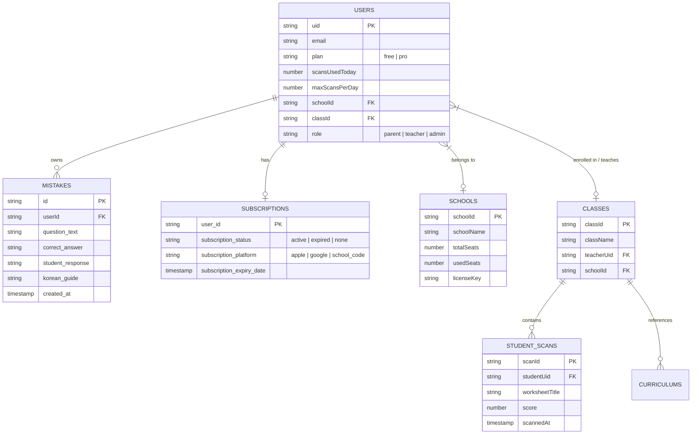

# 🗄️ Chekki AI - Database Schema Document

**Document Version:** 2.0  
**Status:** Approved / Active  
**Database Engine:** Google Cloud Firestore (NoSQL Document Store)  
**Target Audience:** Backend Engineers, Database Administrators, Security Auditors  

---

## 1. Entity Relationship Diagram (ERD)

The diagram below maps the Firestore document hierarchy, subcollections, and reference pointers across Chekki AI.



---

## 2. Comprehensive Collection Specifications

### 2.1 Collection: `users/{userId}`
Stores user identity, role, subscription tier, and daily scan quota tracking.

| Field Name | Type | Required | Description & Constraints |
| :--- | :--- | :--- | :--- |
| `name` | `string` | Yes | Full name of parent or teacher. |
| `email` | `string` | Yes | Authenticated email address. |
| `plan` | `string` | Yes | Billing tier: `'free'` or `'pro'`. |
| `role` | `string` | No | User role: `'parent' \| 'teacher' \| 'admin'`. Default: `'parent'`. |
| `scansUsedToday` | `number` | Yes | Scans performed on current UTC date. Resets daily. |
| `maxScansPerDay` | `number` | Yes | Limit cap: `2` for Free, `9999` for Pro. |
| `lastScanDate` | `string` | Yes | ISO date string (`YYYY-MM-DD`) of last scan. |
| `questionsUsedToday`| `number` | Yes | Daily limit tracker for AI Q&A prompts. |
| `maxQuestionsPerDay`| `number` | Yes | Cap for questions (Free: 5, Pro: 9999). |
| `lastQuestionDate` | `string` | Yes | ISO date string of last question prompt. |
| `schoolId` | `string \| null`| No | Foreign key linking user to a `schools` document. |
| `schoolName` | `string \| null`| No | Cache of institutional name for rapid UI display. |
| `classId` | `string \| null`| No | Foreign key linking parent/student to a `classes` document. |
| `childAge` | `string` | No | Target age of learner (e.g., `"6"`). |
| `childEnglishLevel`| `string` | No | Learner level (e.g., `"Beginner"`, `"Phonics"`). |
| `subscriptionStartedAt`| `timestamp`| No | Timestamp when Pro plan was unlocked. |
| `subscriptionPlatform` | `string` | No | Source platform (`'apple'`, `'google'`, `'school_code'`). |

---

### 2.2 Collection: `subscriptions/{userId}`
Managed exclusively by backend Admin SDK (Vercel API Gateway). Stores payment receipt tokens and verification metadata.

| Field Name | Type | Description |
| :--- | :--- | :--- |
| `user_id` | `string (PK)` | Matches Firebase Auth `uid`. |
| `subscription_status` | `string` | `'active' \| 'expired' \| 'cancelled' \| 'none'`. |
| `subscription_platform`| `string` | `'apple' \| 'google' \| 'web' \| 'school_code' \| 'admin_upgrade'`. |
| `subscription_expiry_date`| `string \| null`| ISO timestamp of next billing / expiration date. |
| `apple_receipt` | `string \| null`| Encrypted Apple IAP transaction receipt token. |
| `google_purchase_token` | `string \| null`| Android Google Play Purchase Token. |
| `updated_at` | `timestamp` | Server updated timestamp. |

---

### 2.3 Collection: `mistakes/{mistakeId}`
Auto-saved repository of student homework errors used for analytics and AI practice sheet generation.

| Field Name | Type | Description |
| :--- | :--- | :--- |
| `id` | `string (PK)` | Unique mistake document ID. |
| `userId` | `string` | Foreign Key pointing to `users/{userId}`. |
| `question_text` | `string` | Original English question text ($<1000$ chars). |
| `correct_answer` | `string` | Model verified correct answer. |
| `student_response` | `string` | Student's incorrect response detected via OCR. |
| `korean_guide` | `string` | Brief explanation of the error in Korean. |
| `teaching_script_ko` | `string` | Parent speech script ("what to say"). |
| `item_type` | `string` | Question category (`'fill_in'`, `'mcq'`, `'phonics'`, `'matching'`). |
| `created_at` | `timestamp` | Document creation timestamp. |

---

### 2.4 Collection: `schools/{schoolId}`
Maintains hagwon / EK organization profiles and active seat allocations.

| Field Name | Type | Description |
| :--- | :--- | :--- |
| `schoolId` | `string (PK)` | Unique institutional slug (e.g., `"poly_daechi"`). |
| `schoolName` | `string` | Display name (e.g., `"Poly Academy Daechi"`). |
| `activationCodes` | `array<string>`| Active redemption codes assigned to school (e.g., `["POLY10", "POLY2026"]`). |
| `totalSeats` | `number` | Total paid seat licenses allocated. |
| `usedSeats` | `number` | Seats redeemed by student/parent accounts. |
| `created_at` | `timestamp` | School creation timestamp. |

---

### 2.5 Collection: `classes/{classId}` & Subcollection `studentScans`
Enables teachers to view homework performance across enrolled classroom students.

#### `classes/{classId}`
* `classId`: `string (PK)`
* `className`: `string` (e.g., `"Phonics K3 - Morning Class"`)
* `teacherUid`: `string` (FK pointing to `users/{userId}`)
* `schoolId`: `string` (FK)

#### Subcollection: `classes/{classId}/studentScans/{scanId}`
* `scanId`: `string (PK)`
* `studentUid`: `string` (FK)
* `studentName`: `string`
* `worksheetTitle`: `string`
* `totalItems`: `number`
* `correctCount`: `number`
* `scannedAt`: `timestamp`

---

### 2.6 Collection: `curriculums/{curriculumId}`
Stores pre-seeded Hagwon and English Kindergarten curriculum modules, reading passages, and vocabulary terms uploaded by teachers to pre-seed Gemini's context window.

| Field Name | Type | Description |
| :--- | :--- | :--- |
| `curriculumId` | `string (PK)` | Unique curriculum record ID (e.g., `"poly_6a_week4"`). |
| `classId` | `string` | Foreign key linking curriculum to `classes/{classId}`. |
| `teacherUid` | `string` | Foreign key linking to the instructor who pre-seeded the unit. |
| `topic` | `string` | Phonics rule / Unit topic (e.g., `"Silent 'e' Long Vowels"`). |
| `passage` | `string` | Full reading passage text for context pre-seeding ($\le 10,000$ chars). |
| `targetVocab` | `array<string>`| Expected target vocabulary list (e.g., `["umbrella", "neighborhood", "adventure"]`). |
| `other` | `string` | Additional pedagogical notes / instructions ($\le 10,000$ chars). |
| `created_at` | `timestamp` | Timestamp when pre-seeding record was saved. |

---

## 3. Server-Only Control Collections (Read/Write Blocked)

The following collections deny all client-side Firestore access and are accessed exclusively by serverless backend logic:

1. `ratelimits/{docId}`: IP & user rate limit token buckets.
2. `quiz_quotas/{docId}`: Daily AI quota state locks.
3. `idempotency_keys/{docId}`: Deduplication locks for API requests.
4. `school_invoices/{docId}`: B2B billing and invoicing history.

---

## 4. Required Composite Indexes

```json
{
  "indexes": [
    {
      "collectionGroup": "mistakes",
      "queryScope": "COLLECTION",
      "fields": [
        { "fieldPath": "userId", "order": "ASCENDING" },
        { "fieldPath": "created_at", "order": "DESCENDING" }
      ]
    },
    {
      "collectionGroup": "studentScans",
      "queryScope": "COLLECTION_GROUP",
      "fields": [
        { "fieldPath": "studentUid", "order": "ASCENDING" },
        { "fieldPath": "scannedAt", "order": "DESCENDING" }
      ]
    }
  ]
}
```
