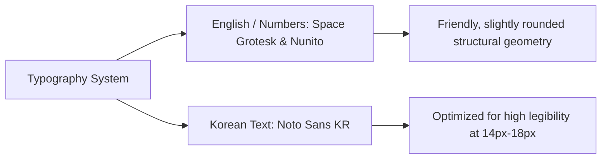

# 🎨 Chekki AI - UI/UX Design Brief & Visual Guidelines

**Document Version:** 2.0  
**Status:** Approved / Active  
**Author:** Lead UI/UX Product Designer  
**Target Audience:** Frontend Engineers, UI/UX Designers, Brand Designers  

---

## 1. Creative Direction & Brand Personality

Chekki AI is designed as a **warm, empathetic, and trustworthy educational companion**—never a rigid or punitive grading tool. It balances physical paper warmth with modern digital precision.

### 1.1 Core Design Pillars
1. **Bonding Over Correction:** The UI highlights encouragement and parenting scripts ("what to say") rather than harsh red marks or intimidating scorecards.
2. **The Paper-to-Digital Bridge:** Maintain a strong tactile link to physical homework. The workspace overlays high-fidelity digital ink and highlights directly over the original paper photograph.
3. **Empathy-First Microcopy:** Microcopy directly alleviates parent anxiety (e.g., *"영어를 몰라도 괜찮아요. 쳌키가 함께할게요"* — "It's okay if you don't speak English. Chekki is with you").
4. **Anti-SaaS Slop Guidelines:** Strictly avoid generic dark-blue dashboard templates, nested card clutter, generic purple-to-blue text gradients, and standard unstyled Inter fonts.

---

## 2. Color Palette & Token System

Our color palette uses curated, harmonious HSL tones featuring warm paper neutrals, calm educational blues, and vibrant feedback accents.

```css
:root {
  /* Primary & Brand Base */
  --color-brand-primary: #3B82F6;     /* Edu Blue - Calm & Trustworthy */
  --color-brand-secondary: #4F46E5;   /* Deep Indigo */
  --color-brand-accent: #8B5CF6;      /* Pro Violet */

  /* Surface & Backgrounds */
  --color-bg-app: #F8FAFC;            /* Warm Cool Slate Surface */
  --color-bg-paper: #FFFDF9;          /* Skeuomorphic Paper Cream */
  --color-bg-card: #FFFFFF;           /* Pure Card Surface */
  --color-bg-overlay: rgba(15, 23, 42, 0.6); /* Backdrop Dim */

  /* Interactive Feedback Tokens */
  --color-correct-green: #10B981;     /* Emerald Green (Correct Answer) */
  --color-correct-bg: rgba(16, 185, 129, 0.15);
  --color-incorrect-rose: #F43F5E;    /* Coral Rose (Incorrect Answer) */
  --color-incorrect-bg: rgba(244, 63, 94, 0.18);
  --color-warning-amber: #F59E0B;    /* Handwriting / Review Tip */
  --color-pro-gold: #F59E0B;         /* Chekki Pro Badge Gold */

  /* Text & Typography Tokens */
  --color-text-main: #0F172A;         /* Slate 900 */
  --color-text-muted: #64748B;        /* Slate 500 */
  --color-text-ko-script: #1E293B;     /* High Contrast Korean Script */

  /* Shadows & Elevation */
  --shadow-card: 0 4px 20px -2px rgba(15, 23, 42, 0.06);
  --shadow-drawer: 0 -8px 30px rgba(0, 0, 0, 0.12);
  --shadow-glow-pro: 0 0 25px rgba(139, 92, 246, 0.35);
}
```

---

## 3. Dual-Language Typography System

Chekki AI handles simultaneous high-density English and Korean content. Typography pairing ensures visual harmony between Latin letterforms and Korean Hangul blocks.



### 3.1 Type Scale & Hierarchy

| Role | Font Family | Size / Line-Height | Weight | Usage |
| :--- | :--- | :--- | :--- | :--- |
| **Hero Title** | `Space Grotesk` / `Noto Sans KR` | 28px / 1.2 | 700 (Bold) | Workspace Header, Onboarding Welcome |
| **Section Heading** | `Space Grotesk` / `Noto Sans KR` | 20px / 1.3 | 600 (SemiBold) | Detail Drawer Titles, Modal Headers |
| **Parent Script Body**| `Noto Sans KR` | 17px / 1.6 | 500 (Medium) | Korean Parent Guidance Script ("엄마가 말할 내용") |
| **Worksheet Text** | `Nunito` / `Noto Sans KR` | 15px / 1.4 | 600 (SemiBold) | English Question & Answer Text |
| **Caption & Badges** | `Space Grotesk` | 12px / 1.2 | 700 (Bold) | Bounding Box Tags, Quota Counters |

---

## 4. Key Component Design Guidelines

### 4.1 Skeuomorphic Bounding Box Overlays
* **Visual Style:** Rounded rectangle highlights (`border-radius: 8px`) drawn directly over the worksheet photo.
* **Border & Fill:** 2px solid border (`--color-correct-green` or `--color-incorrect-rose`) with 15% opacity fill.
* **Badge Trigger:** Small floating pill at the top-left of each box indicating item number and state check mark/cross. Tapping expands the box with a spring animation.

### 4.2 Korean Guidance Drawer ("Mom's Helper Drawer")
* **Positioning:** Bottom sheet drawer sliding smoothly over the lower third of the screen.
* **Header:** Warm pill badge: *"💡 이렇게 아이를 이끌어주세요"* (Lead your child like this).
* **Script Container:** Soft paper cream background (`--color-bg-paper`) with direct quotes highlighted in dark slate text and friendly quote mark iconography.
* **Action Strip:** Dual buttons: **"🔊 들어보기"** (Listen to TTS) and **"⭐ 아이 칭찬하기"** (Praise Child).

### 4.3 Interactive Shimmer Scanner Beam (`analyzing` state)
* **Animation:** Smooth top-to-bottom laser scan line (`height: 3px`, glowing blue gradient) sweeping across the captured worksheet.
* **Status Card:** Floating central glassmorphism card displaying rotating Korean encouraging messages (e.g., *"손글씨를 읽고 있어요...", "정답을 확인하는 중이에요..."*).

### 4.4 Teacher Curriculum Pre-Seeding Console
* **Visual Style:** Clean, utilitarian bento-grid card layout with high-density inputs.
* **Passage & Keyword Area:** Multi-line text field with live token count indicator and keyword auto-chip conversion on space/comma.
* **Status Pill:** Prominent badge showing *"🟢 Active Class Context Injected"* to reassure instructors that Gemini is aligned with their current unit.

### 4.5 Monthly Parent Progress Report Card
* **Header & Banner:** Executive growth card featuring institutional branding (e.g. *Poly Academy Daechi*), student name pill, and monthly mastery percentage dial.
* **Mastery Breakdown Table:** Dual English/Korean grid featuring topic chips, mastery icons (Mastered 96% vs Review Needed 80%), and exact scan accuracy counts.
* **Mom's Praise Script Container:** Highlighted quotes container featuring a warm yellow background accent (`rgba(245, 158, 11, 0.1)`) and direct speech bubble styling.
* **Teacher Note Card:** Italicized card containing instructor's signature and direct feedback note.

---

## 5. Micro-Interactions & Motion Principles

1. **Drawer Drag Physics:** Bottom sheet utilizes rubber-band spring dampening on touch drag (using CSS `cubic-bezier(0.34, 1.56, 0.64, 1)`).
2. **Praise / Celebration Trigger:** Tapping "Praise Child" or achieving a 100% score triggers a burst of gold confetti stars across the workspace canvas.
3. **Scan Button Feedback:** Large central shutter button features a tactile pulse ring on camera active.

---

## 6. Accessibility & Responsiveness (WCAG 1.4.4)

* **Touch Target Sizes:** All buttons, bounding box tap areas, and drawer handles maintain a minimum touch target of **48 x 48 dp**.
* **Viewport Multi-Touch Zoom:** Scanned worksheet container explicitly allows multi-touch pinch-to-zoom and panning (`touch-action: manipulation`, viewport scale maximum set to `5.0`).
* **Contrast Ratios:** All Korean parenting scripts maintain a text contrast ratio $> 7:1$ against background surfaces for effortless reading under varied home lighting conditions.
