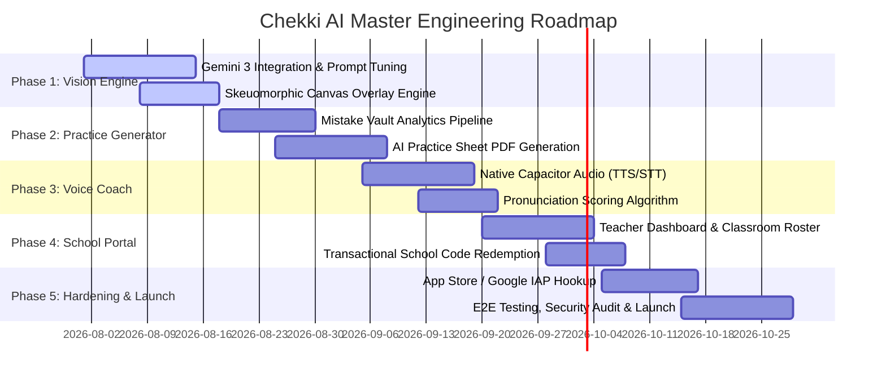

# 🏗️ Chekki AI - Engineering Master Plan

**Document Version:** 2.0  
**Status:** Approved / Active  
**Lead Author:** Vice President of Engineering / Tech Lead  
**Target Audience:** Engineering Leads, Software Engineers, QA Leads, Product Management  

---

## 1. Executive Strategy & Goals

The Chekki AI Engineering Plan outlines the multi-phase technical roadmap required to deliver a robust, high-performance, and scalable AI platform. Engineering priorities focus on:

1. **Sub-3.5s Multimodal Vision Pipeline:** Delivering rapid Gemini 3 inference with precise bounding box overlay alignment.
2. **Offline-Resilient Mobile Architecture:** Ensuring seamless performance on Capacitor iOS/Android runtimes across variable mobile networks.
3. **High-Value Pro Features:** Shipping the AI Practice Sheet Generator and Native Audio Voice Coach to maximize free-to-paid conversion.
4. **Enterprise Scale:** Supporting B2B hagwon/school deployments with secure role-based access and code activation systems.

---

## 2. Engineering Roadmap & Phase Breakdown



---

### Phase 1: Core Multimodal Vision Engine & Workspace Optimization
* **Objective:** Achieve sub-3.5 second scan latency and pixel-perfect skeuomorphic ink overlays.
* **Key Tasks:**
  1. Optimize Gemini 3 JSON output prompt structure and set up fallbacks for low-confidence handwriting reads.
  2. Implement dynamic viewport scaling math for normalized `[ymin, xmin, ymax, xmax]` bounding box translation in `App.tsx` / `Workspace.tsx`.
  3. Implement progressive image loading and transient Cloudinary caching.
  4. Ensure WCAG 1.4.4 touch gesture compatibility for multi-touch pinch-to-zoom.

---

### Phase 2: AI Practice Sheet Generator & Parent Report Generator
* **Objective:** Enable one-tap customized practice worksheet generation and automated parent growth reporting.
* **Key Tasks:**
  1. Build auto-categorization worker grouping items by `item_type` (`phonics`, `grammar`, `vocabulary`).
  2. Write Gemini 3 prompt templates for generating fresh, curriculum-aligned exercises.
  3. Build client-side PDF renderer generating A4 printable practice sheets with original styling.
  4. Develop **Automated Parent Progress Report Engine** compiling 30-day scan accuracy, mastery tables, and custom Korean Mom's Praise Scripts into shareable PDF & KakaoTalk image cards.

---

### Phase 3: Native Audio Subsystem & Pronunciation Coach
* **Objective:** Integrate high-fidelity native TTS and speech scoring for child audio interaction.
* **Key Tasks:**
  1. Integrate Capacitor Text-to-Speech plugin for iOS/Android native voice fallback.
  2. Implement client-side speech recording with microphone permission flows.
  3. Implement Levenshtein string-distance phoneme matcher scoring child responses from 0 to 100%.

---

### Phase 4: School Code, Teacher Pre-Seeding & Classroom Portal
* **Objective:** Roll out institutional tier features for hagwons and English Kindergartens.
* **Key Tasks:**
  1. Build transactional school code redemption backend in Vercel Serverless Functions with atomic seat decrementing.
  2. Build **Teacher Curriculum Pre-Seeding Module** allowing instructors to upload weekly textbook passages and target vocabulary into `curriculums/{curriculumId}`.
  3. Wire active class curriculum context injection into Gemini 3 API prompt pipeline for near-100% OCR accuracy.
  4. Create Teacher Dashboard (`/teacher/classes`) displaying aggregate class scores, student scan feeds, and instructor evaluation note entry fields.
  5. Implement classroom roster invitation and student-teacher data access authorization in Firestore Security Rules.

---

### Phase 5: Production Hardening, Monetization & Release
* **Objective:** Finalize paywalls, pass App Store / Google Play guidelines, and conduct end-to-end security verification.
* **Key Tasks:**
  1. Wire Apple StoreKit 2 & Google Play Billing native SDKs via Capacitor.
  2. Conduct comprehensive security rule audit using `@firebase/rules-unit-testing`.
  3. Load test Vercel API Gateway to handle up to 500 concurrent scan requests per minute.

---

## 3. Technical Risk Matrix & Mitigation Strategies

| Risk Description | Severity | Impact | Mitigation Strategy |
| :--- | :--- | :--- | :--- |
| **Gemini Vision Hallucination** on ambiguous handwriting | High | Incorrect grading shown to parent | Implement handwriting confidence scoring (`confidence_score < 0.7` displays a warning prompt *"Please double check this item"*). |
| **Poor Lighting / Blurry Photos** taken by young children | Medium | Failed bounding box extraction | Client-side image contrast enhancement and pre-flight blur detection before sending to API. |
| **Vercel API Gateway Timeout** on large image payloads | High | 504 Timeout Error | Compress images client-side to $<1.5$ MB before API transmission; implement 8-second request timeout with retry. |
| **IAP Receipt Fraud / Spoofing** | Critical| Revenue loss | Enforce mandatory backend server-to-server receipt validation with Apple App Store API before granting Pro plan status. |

---

## 4. QA, Automated Testing & Verification Strategy

### 4.1 Unit & Integration Testing
* **Frontend Components:** Vitest + React Testing Library testing state transitions (`idle` $\rightarrow$ `analyzing` $\rightarrow$ `workspace`).
* **API Endpoints:** Supertest testing Vercel API gateway handlers and Gemini response parsers.

### 4.2 Security Rules Verification
Automated test suite validating Firestore security rules:
```typescript
describe('Firestore Security Rules', () => {
  it('prevents regular users from modifying their plan or scansUsedToday', async () => {
    const userDb = getAuthedFirestore({ uid: 'user_123' });
    const userRef = doc(userDb, 'users', 'user_123');
    await assertFails(updateDoc(userRef, { plan: 'pro' }));
  });
});
```

### 4.3 End-to-End (E2E) & Mobile Verification
* Automated Playwright test scripts running on web SPA.
* Native Capacitor test suite executed on iOS Simulator (iPhone 15 Pro) and Android Emulator (Pixel 8).

---

## 5. Release Readiness Checklist

- [ ] All 6 core documents (PRD, TDD, User Flow, UI/UX Design Brief, Database Schema, Engineering Plan) reviewed and committed to `/docs`.
- [ ] Firestore Security Rules deployed and verified against security auditor suite.
- [ ] Gemini 3 API keys secured exclusively within serverless environment variables.
- [ ] Capacitor iOS & Android builds compiling cleanly with zero native build warnings.
- [ ] App Store Privacy Labels and COPPA compliance documentation complete.
