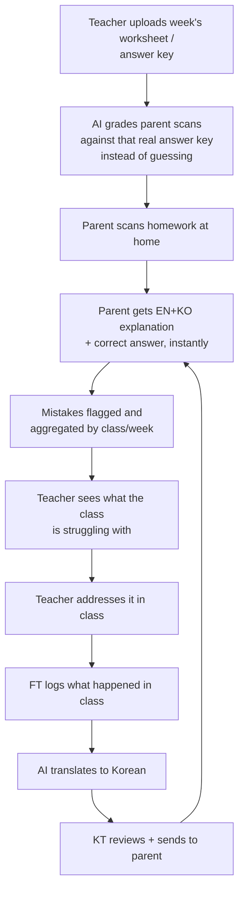

# Chekki AI — Product Requirements Document

**Version:** 3.0
**Status:** Active / Canonical
**Supersedes:** `docs/archive/PRD.md`, `PRODUCT.md`, `CHEKKI_OVERVIEW.md`, `CHEKKI_MASTER_SPECIFICATION.md`, `PROJECT_OVERSIGHT.md`, `CHEKKI_ACADEMY_PRODUCT_PROFILE.md`, `CHEKKI_EDTECH_PROFILE.md`, `FEATURES_TO_ADD.md`, `USER_FLOW.md` (see `docs/archive/` — kept for history, no longer authoritative)
**Companion docs:** [`SCOPE.md`](./SCOPE.md) (what's in/out and why), [`DECISIONS.md`](./DECISIONS.md) (open questions and past trade-offs)

---

## Why this document exists

As of this version, Chekki AI had accumulated nine overlapping, partially-contradictory product documents — some unedited since the project's original scaffolding, one explicitly labeled "authoritative" while describing features that had since been cut. This document replaces all of them with a single current source of truth. When code and doc disagree, trust the code and file a correction here, not the other way around.

---

## 1. Tagline & Vision

**Tagline:** "채점은 채키가, 칭찬은 엄마가" — *"Grading by Chekki, Praise by Mom."*

**Vision:** Turn the nightly English-homework battle between tired Korean parents and their kids into a bonding moment, by taking grading and explanation off the parent's plate — then extend the same relief to the teachers and academies those kids attend.

**Origin:** The product started as a pure parent-facing tool. A parent — often exhausted after work, not fluent in English herself — points her phone at her child's English homework. Chekki grades it, explains every mistake in warm Korean, and tells her exactly what to say to her child. No English fluency required, no red pen, no fight.

It later grew a second half: academies (hagwons/English Kindergartens) wanted the same relief for their teachers, and a way to close the loop between what a child got wrong at home and what happens in class the next day. That's the current product: **two connected surfaces — a parent-facing app and a staff-facing dashboard — joined by one core loop.**

---

## 2. Problem Statement

1. **Parent-child homework friction.** Parents managing English homework in a language they don't speak fluently experience real stress; correcting mistakes badly (or not explaining them at all) creates conflict and erodes the child's confidence.
2. **Disconnected loop.** A mistake made at home was invisible to the teacher, and what happened in class was invisible to the parent. Without a channel between the two, exactly the moments that matter most for a kid to actually learn something get lost.
3. **Teacher grading load.** Academy teachers spend real hours grading repetitive homework and writing individual parent updates by hand, in a second language (English-speaking foreign teachers writing for Korean-speaking parents).

---

## 3. User Personas & Roles

| Role | Who | Core need |
|---|---|---|
| **Parent** ("Min-ji," 34) | Mother of a 5–7yo in an English Kindergarten/hagwon. Not fluent in English, tired after work. | Instant grading + Korean explanation + exact words to say to her kid. |
| **Foreign Teacher (FT)** ("David," 28) | Native-English instructor, teaches the class. | Fast way to log what happened in class and flag which kids need help — without writing Korean. |
| **Korean Teacher (KT)** | Bilingual staff member, liaises with parents. | Review the FT's log, make sure the Korean parent-facing version is right, send it. |
| **Director** | Academy owner/admin. | Set up classes, invite staff and parents, see the whole campus at a glance. |

Each role gets its own dashboard (`NativeFtDashboard`, `NativeKtDashboard`, `NativeDirectorPortal`) rendered from one shared router (`src/pages/TeacherPage.tsx`), gated by `user.role` / `educatorRole`. The parent-facing app is a separate surface entirely (`App.tsx` root, mobile-first).

---

## 4. The Core Loop

This is the product. Everything else is in service of this loop or it's scope creep (see `SCOPE.md`).

**Stage-by-stage requirements:**

1. **Scan → explanation (parent app).** Camera or file upload (PNG/JPG/HEIC/PDF) → `/api/analyze` → Gemini vision → structured JSON (bounding boxes, correct answer, Korean teaching script, English explanation) → rendered as overlays on the original image. This is the most mature, most heavily-hardened path in the codebase — treat changes here with the most caution.
2. **Teacher answer-key upload → grading context.** FT/KT uploads the week's worksheet (`CurriculumEditorForm`, `mode: 'textbook_curriculum_ocr'`) → extracted into a `curriculums` Firestore doc keyed by class + week → injected into the grading prompt for any student scan against that class/week, so the AI grades against a real answer key instead of inferring one. This is what makes the school product materially more accurate than the standalone parent app.
3. **Mistake flagging → teacher visibility.** Red-bordered mistakes from student scans aggregate into a "trouble words" view and a flagged-exceptions list on the Director/FT dashboards, so a teacher can see what the whole class is missing without reading every scan individually.
4. **Syllabus/textbook upload.** Separate from #2 — FT/KT can upload a syllabus, table of contents, or textbook index (`mode: 'syllabus_course_plan'`) to set the term-level scope (vocab/phonics range across many units), distinct from a single week's answer key. *Why it exists:* the weekly worksheet upload only teaches the AI one week at a time, cold, right before that week starts. The syllabus front-loads the whole term's vocab/phonics scope up front, so the AI already has curriculum context before the first worksheet of the term is ever scanned — fewer hallucinated corrections early on, and grading stays consistent across weeks instead of resetting each time. See `DECISIONS.md` #008 for how it coexists with #2 without overwriting it.
5. **FT log → KT review → parent send.** FT fills a ~30-second form (`NativeTeacherLogForm`) describing the day's class. AI translates/drafts a Korean parent update. KT reviews, edits if needed, and sends (`NativeKtDashboard`, states: `pending_review` → `edited_by_kt` → `copied_sent`).
6. **Access.** A parent or teacher gets into a class exactly one way: a director-generated, single-use invite (email link, with the code as a manual-entry fallback if the link doesn't open). The old self-serve shared class code was removed — see `DECISIONS.md` #001.

---

## 5. Non-Functional Requirements

- **Latency:** camera capture → first rendered overlay in well under 5s on a normal connection. Grading is the product; if it's slow, there is no product.
- **Reliability of failure, not just success.** This was a real gap surfaced during an August 2026 bug-fixing pass: errors from `/api/analyze` and Firestore reads were being swallowed into generic or misleading messages (e.g. a bare `ANALYSIS_FAILED` code, or an invite panel silently showing "0 invited" while actually still loading). `utils/describeError.ts` and `utils/validate.ts` exist to standardize this going forward — new code touching an API call or a Firestore read should use them rather than inventing another one-off error path.
- **i18n:** full Korean/English parity throughout; Korean is not a secondary/fallback language, it's the primary language for roughly half the user base (parents).
- **Security:** Firestore rules scope every read to the caller's own school/class; server-only writes (Admin SDK) for anything security-sensitive (invite codes, class membership).

---

## 6. Success Metrics

Carried forward from the prior PRD as directional targets — **not yet validated against real usage data**, and worth revisiting once there's actual traffic to measure against:

- Scan completion rate (successful structured-analysis result): >98% target
- 7-day and 30-day parent retention
- FT log → KT send turnaround time (proxy for whether the report-generation loop is actually saving KT time, its core value prop)
- Free → paid conversion rate for the parent app

Whoever owns this next should treat these as hypotheses to instrument for, not settled numbers.

---

## 7. Out of Scope

See [`SCOPE.md`](./SCOPE.md) for the full list of what's deliberately not built or was cut, and why.
