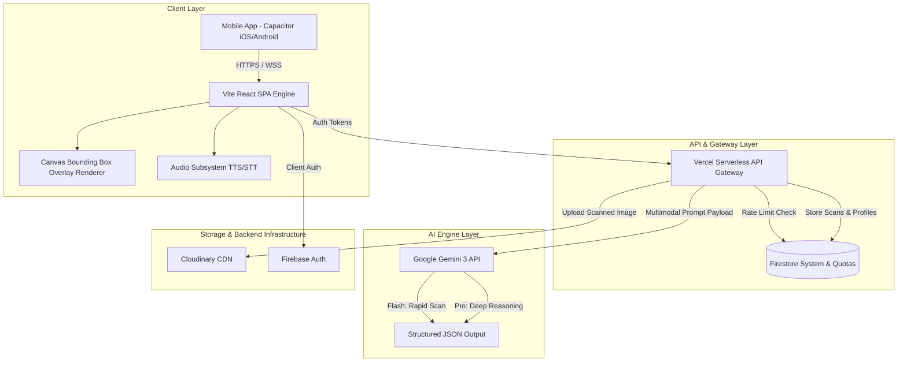

# 🛠️ Chekki AI - Technical Design Document (TDD)

**Document Version:** 2.0  
**Status:** Approved / Active  
**Author:** Lead Architect & Engineering Team  
**Target Audience:** Software Engineers, DevOps, System Architects  

---

## 1. System Architecture Overview

Chekki AI utilizes a modern hybrid architecture combining a high-performance cross-platform web/mobile client built with **React**, **TypeScript**, and **Capacitor**, connected to a cloud backend powered by **Firebase** and **Vercel Serverless Functions**, with intelligence provided by **Google Gemini 3 (Flash & Pro)**.



---

## 2. Technology Stack Matrix

| Layer | Technology / Library | Purpose & Rationale |
| :--- | :--- | :--- |
| **Frontend UI** | React 18 + TypeScript | Componentized, type-safe user interface development. |
| **Build System** | Vite | Lightning-fast HMR and bundle optimization. |
| **Mobile Runtime** | Ionic Capacitor 5+ | Wraps web asset for native iOS & Android deployment. |
| **Styling** | Vanilla CSS (CSS Modules / Custom Tokens) | Maximum control, zero CSS runtime overhead, pixel-perfect design. |
| **Authentication** | Firebase Auth | OAuth 2.0, Email/Password, Apple Sign-In support. |
| **Database** | Cloud Firestore | Real-time NoSQL database with offline persistence. |
| **Serverless API** | Vercel Node.js Serverless Functions | Edge-located backend processing and secret key isolation. |
| **Media Management**| Cloudinary CDN | Image optimization, thumbnailing, and fast delivery. |
| **AI Inference** | Google Gemini 3 (Flash & Pro) | Vision OCR, handwriting analysis, Korean parent scripting. |
| **Audio Engine** | Web Speech API + Capacitor Native Audio | Cross-platform text-to-speech & speech recognition. |

---

## 3. Core Multimodal AI Pipeline

### 3.1 Inference Workflow & Prompt Engineering
1. **Image Preprocessing:** Client captures/scales photo to max 2048px width, converts to standard JPEG/PNG byte stream, and uploads to Cloudinary for transient storage.
2. **Gateway Payload:** Client sends image URL / base64 payload to `/api/analyze` along with user JWT token, `classId` / `schoolId` (if enrolled), and tier status (`free` or `pro`).
3. **Curriculum Context Injection:** If user is assigned to a class with pre-seeded curriculum (`curriculums/{curriculumId}`), the API fetches active weekly topics, target passages, and vocabulary lists, injecting them directly into Gemini 3's system instructions:
   ```text
   SYSTEM CONTEXT: Active Class Curriculum for [Daechi Poly 6A - Week 4]
   Target Phonics: Silent 'e' Long Vowels (cake, hope, bite)
   Textbook Passage: "The Brave Duckling's Big Adventure..."
   Expected Handwriting Vocabulary: [umbrella, neighborhood, adventure]
   ```
4. **Model Selection & Thinking Budget:**
   * **Free Explorer:** Routes to `gemini-3-flash` (Speed optimized, standard response).
   * **Chekki Pro:** Routes to `gemini-3-pro-preview` with an expanded thinking budget for complex handwriting and contextual reasoning.
5. **Structured JSON Schema Enforcement:**
   The API requests Gemini to return output strictly conforming to the following TypeScript interface:

```typescript
export interface WorksheetAnalysis {
  worksheet_summary?: {
    title_en: string;
    title_ko: string;
    overview_ko: string;
    total_score?: number;
    worksheet_type?: string;
    has_handwriting?: boolean;
    is_handwriting_legible?: boolean;
  };
  content_safety_check?: string;
  items?: Array<{
    id: number;
    type: string;
    question_text: string;
    question_translation?: string;
    correct_answer: string;
    korean_guide: string;
    teaching_script_ko: string;
    teaching_script_en?: string;
    handwriting_tip_ko?: string;
    confidence_score?: number;
    bounding_box?: {
      ymin: number; // 0 to 1000 normalized
      xmin: number;
      ymax: number;
      xmax: number;
    };
    student_response?: string;
    is_correct?: boolean;
  }>;
}
```

---

## 4. Coordinate Transformation & Overlay Engine

To display interactive bounding boxes exactly over the physical worksheet photo regardless of screen size:

1. **Normalized Coordinates:** Gemini 3 returns bounding box coordinates normalized on a 0-1000 scale: `[ymin, xmin, ymax, xmax]`.
2. **Viewport Translation:** The frontend computes scale factors based on natural image dimensions vs visible container bounds:

$$\text{scaleX} = \frac{\text{containerWidth}}{\text{naturalWidth}}, \quad \text{scaleY} = \frac{\text{containerHeight}}{\text{naturalHeight}}$$

$$\text{top} = \frac{ymin}{1000} \times \text{containerHeight}$$

$$\text{left} = \frac{xmin}{1000} \times \text{containerWidth}$$

$$\text{height} = \frac{ymax - ymin}{1000} \times \text{containerHeight}$$

$$\text{width} = \frac{xmax - xmin}{1000} \times \text{containerWidth}$$

3. **Skeuomorphic Ink Overlays:**
   * **Correct items:** Rendered with semi-transparent Emerald Green highlight (`rgba(16, 185, 129, 0.2)`) and green checkmark.
   * **Incorrect items:** Rendered with Coral Rose highlight (`rgba(244, 63, 94, 0.25)`) and interactive guidance trigger badge.

---

## 5. Backend Quota, Rate Limiting & Security

### 5.1 Quota Management Logic
* Daily scan counts are tracked per user in `users/{userId}`.
* Atomic counters (`scansUsedToday`, `lastScanDate`) reset automatically when `lastScanDate != current_utc_date`.
* Pro users bypass scan limits (`maxScansPerDay = 9999`).
* Idempotency keys prevent duplicate billing or quota consumption on retort/network retries.

### 5.2 Security Architecture & Firestore Security Rules
* **Authentication:** All database operations enforce valid Firebase Auth tokens (`request.auth != null`).
* **Profile Isolation:** Users can read/write only their own document (`users/{request.auth.uid}`).
* **Server-Only Collections:** Critical collections such as `ratelimits`, `subscriptions`, and `idempotency_keys` block client reads and writes (`allow read, write: if false;`), accessible exclusively via backend Admin SDK.

```solidity
// Sample Firestore Rule Excerpt
match /users/{userId} {
  allow get: if request.auth != null && (request.auth.uid == userId || isAdmin());
  allow update: if request.auth != null && request.auth.uid == userId 
    && !request.resource.data.diff(resource.data).affectedKeys()
       .hasAny(['role', 'plan', 'scansUsedToday', 'maxScansPerDay']);
}
```

---

## 6. Audio Subsystem (TTS / STT)

### 6.1 Text-to-Speech (TTS)
* Primary: Web Speech API (`window.speechSynthesis`) using `en-US` native voices.
* Native Mobile Fallback: Capacitor Text-to-Speech plugin for offline/iOS native speech synthesis.

### 6.2 Speech Recognition (STT Pronunciation Coach)
* Captures child spoken responses via Web Audio / Capacitor Microphone API.
* Performs Levenshtein distance string similarity matching against expected answer:

$$\text{Similarity Score} = 1 - \frac{\text{LevenshteinDistance}(\text{spoken}, \text{target})}{\max(\text{len}(\text{spoken}), \text{len}(\text{target}))}$$

* Scores $\ge 0.85$ trigger celebratory audio effects and star badge increments.

---

## 7. Operational & Failover Procedures

1. **AI API Degradation:** If Gemini API responds with `503` or timeout (>8s), the API Gateway retries once with fallback model parameters before returning a friendly Korean retry prompt.
2. **Offline Mode:** Scans saved locally in IndexedDB / Capacitor Storage are queued and uploaded automatically when network connectivity resumes.

---

## 8. Parent Growth Report Generator Engine

### 8.1 Data Aggregation & Analytics Pipeline
* **Trigger:** Weekly cron job or manual trigger by parent / teacher via `/api/reports/generate`.
* **Data Sources:** Queries Firestore `studentScans` and `mistakes` over a selected 30-day window.
* **Calculation Rules:**
  * **Mastery Rate:** $\text{Mastery \%} = \frac{\text{Correct Items}}{\text{Total Scanned Items}} \times 100$.
  * **Weakness Extraction:** Identifies top 3 recurring un-mastered phonics rules or vocabulary words with accuracy $< 80\%$.

### 8.2 Rendering & PDF Export Engine
* **Templating:** Serverless worker populates HTML/CSS template containing dual English/Korean mastery tables, teacher evaluation notes, and personalized Mom's Praise Script.
* **PDF Output:** Rendered using headless Chromium on Vercel Serverless to output high-resolution A4 printable PDF and lightweight mobile web viewable image card.
