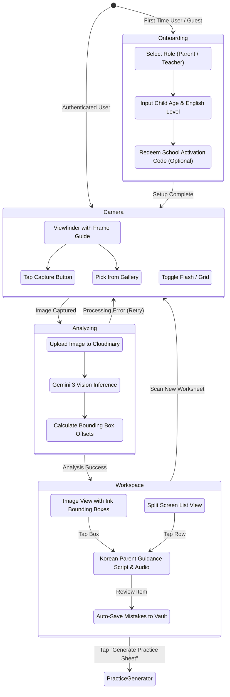
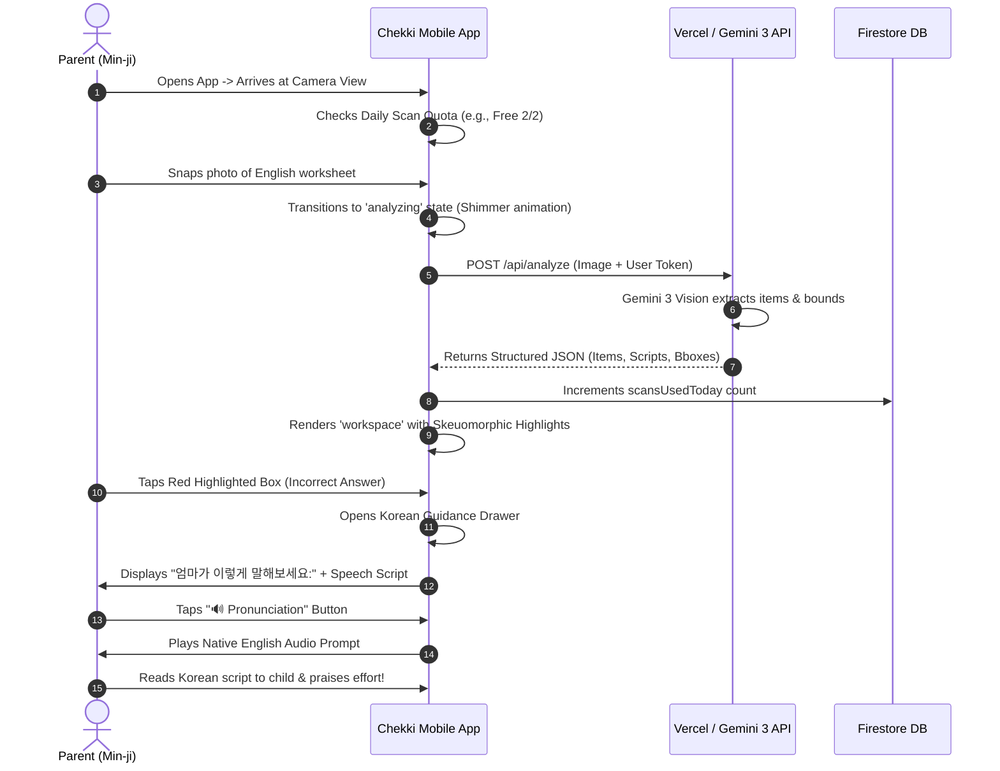
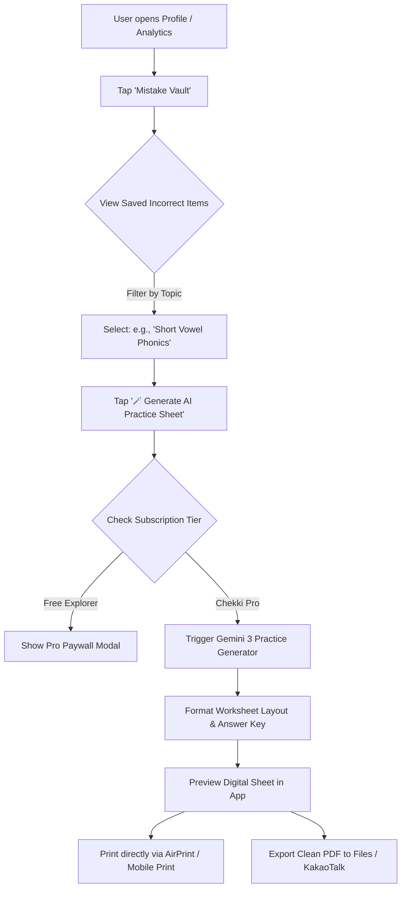
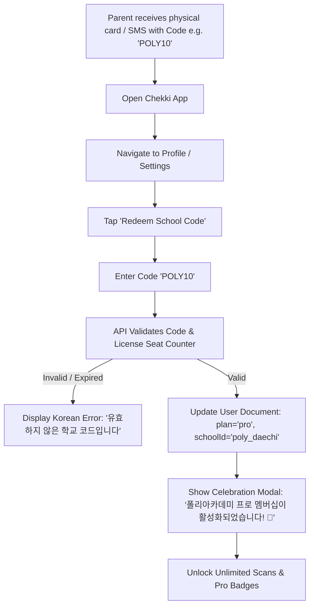
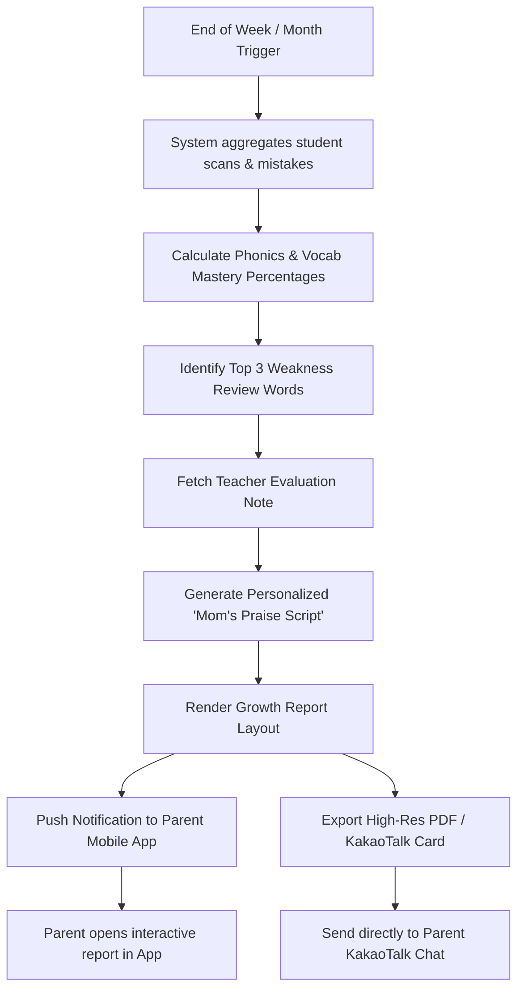

# 🗺️ Chekki AI - User Flow Diagram & App Flow

**Document Version:** 2.0  
**Status:** Approved / Active  
**Author:** Product & UX Design Team  
**Target Audience:** Product Managers, UX Designers, Frontend Engineers, QA Testers  

---

## 1. High-Level Application State Diagram

The Chekki AI interface operates on a state-machine driven single-page architecture with four core views (`onboarding`, `camera`, `analyzing`, and `workspace`).



---

## 2. Detailed User Trajectories

### 2.1 Trajectory A: Primary Magic Scan & Korean Parent Coaching Loop

This is the central daily loop for Korean parents helping their children with evening English homework.



---

### 2.2 Trajectory B: Weakness Drill & AI Practice Sheet Generation

For parents or teachers who want to turn recurring mistakes into custom printable exercises.



---

### 2.3 Trajectory C: School Code & Organization Onboarding Flow

For students and parents receiving institution-sponsored Pro access from their hagwon or English Kindergarten.



---

### 2.4 Trajectory D: Paywall & In-App Purchase Flow

```mermaid
flowchart TD
    A[User reaches daily 2-scan limit OR Taps Pro Feature] --> B[Present Chekki Pro Paywall Modal]
    B --> C[Highlight Pro Benefits: Unlimited Scans, Gemini 3 Pro Deep Reasoning, Voice Coach]
    C --> D{Select Billing Cycle}
    D --> E1[Monthly Pass: ₩14,900/mo]
    D --> E2[Annual Pass: ₩119,000/yr (Save 33%)]
    E1 --> F[Tap 'Subscribe Now']
    E2 --> F
    F --> G[Trigger Native Apple IAP / Google Play Billing Prompt]
    G -->|User Cancels| H[Dismiss Modal -> Return to Free State]
    G -->|Purchase Confirmed| I[Verify Receipt via Backend API]
    I --> J[Update Firestore Subscription Record]
    J --> K[Instant UI Upgrade to Pro Tier]
```

---

### 2.5 Trajectory E: Teacher Curriculum Pre-Seeding Flow

```mermaid
flowchart TD
    A[Teacher logs into Hagwon Portal] --> B[Select Class: e.g. 'Poly 6A']
    B --> C[Tap 'Pre-Seed Weekly Curriculum']
    C --> D[Input Unit Topic, Passage Text & Target Vocab]
    D --> E[Save to Firestore: 'curriculums/{curriculumId}']
    E --> F[When Student Scans Homework]
    F --> G[API fetches Active Class Curriculum Context]
    G --> H[Injects Context into Gemini 3 System Prompt]
    H --> I[OCR Accuracy & Answer Verification Reaches 100%]
```

---

### 2.6 Trajectory F: Automated Weekly/Monthly Parent Report Flow



---

## 3. Screen Navigation Map

| View Name | Primary Function | Key Interactive Components | Transition Targets |
| :--- | :--- | :--- | :--- |
| **`onboarding`** | Initial setup & profiling | Role Selector, Child Age Slider, School Code Input | `camera` |
| **`camera`** | Photo capture & selection | Viewfinder, Shutter Button, Gallery Picker, Flash Toggle | `analyzing`, `profile` |
| **`analyzing`** | Loading & status feedback | Animated Scanner Beam, Encouraging Korean Microcopy | `workspace`, `camera` |
| **`workspace`** | Interactive review interface | Image Overlay Canvas, Toggle (Overlay/Split), Detail Drawer, TTS Audio Button | `camera`, `mistake_vault`, `paywall` |
| **`mistake_vault`** | Historical review & drills | Filter Chips, Mistake Cards, AI Practice Generator Trigger | `workspace`, `practice_preview` |
| **`paywall`** | Subscription conversion | Feature Comparison Table, Plan Cards, Apple/Google Buy Buttons | Returns to previous screen |
